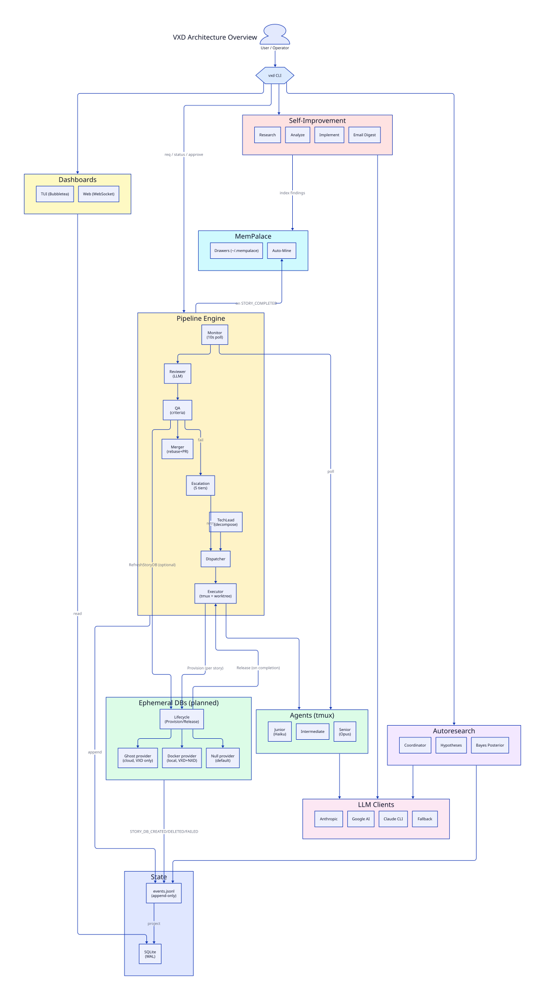
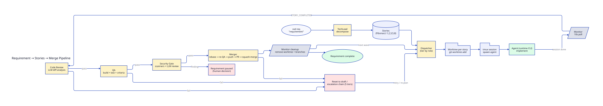
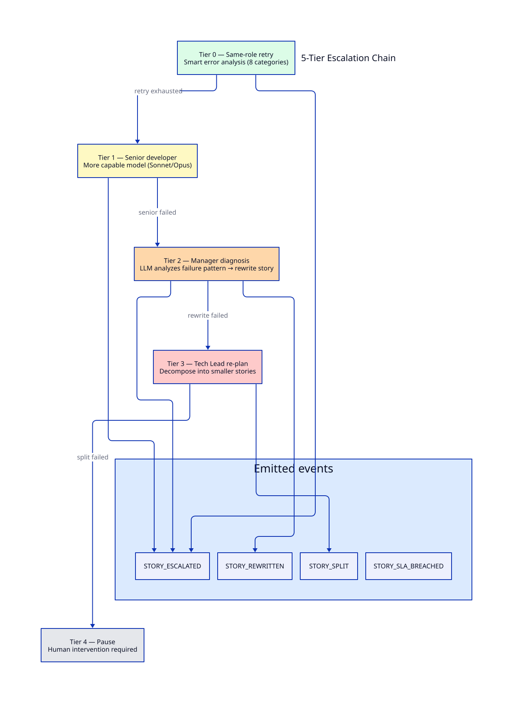
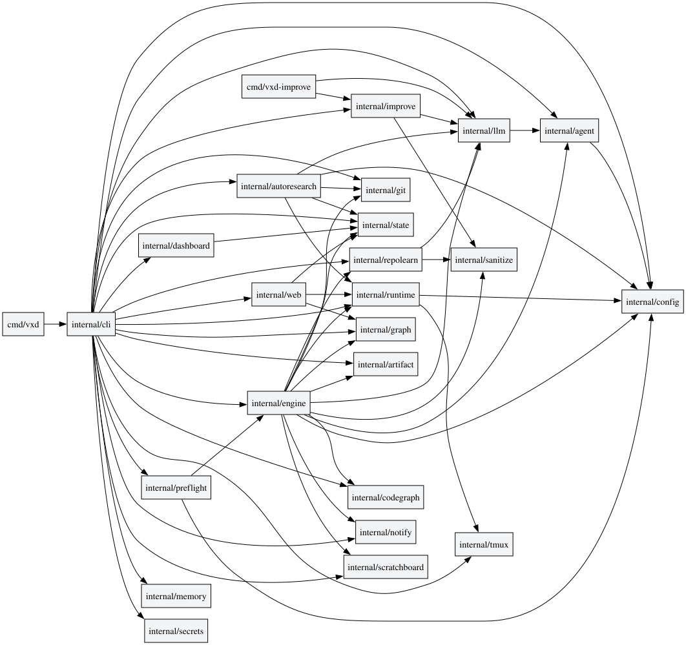
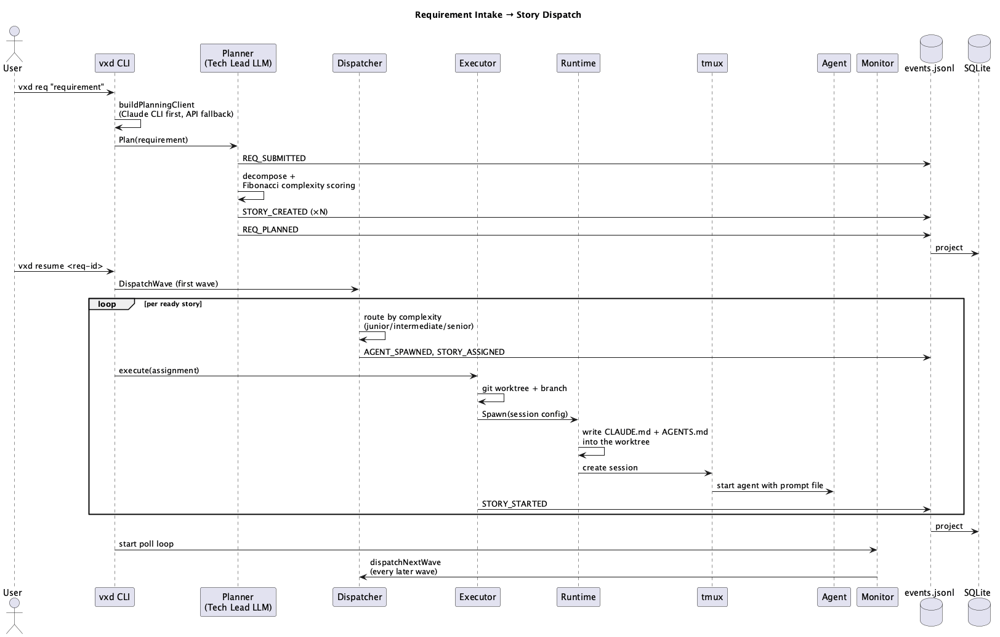
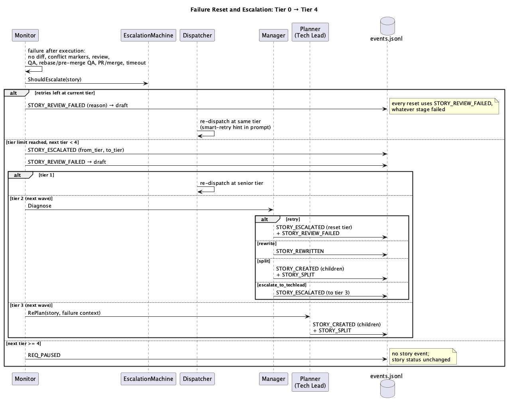
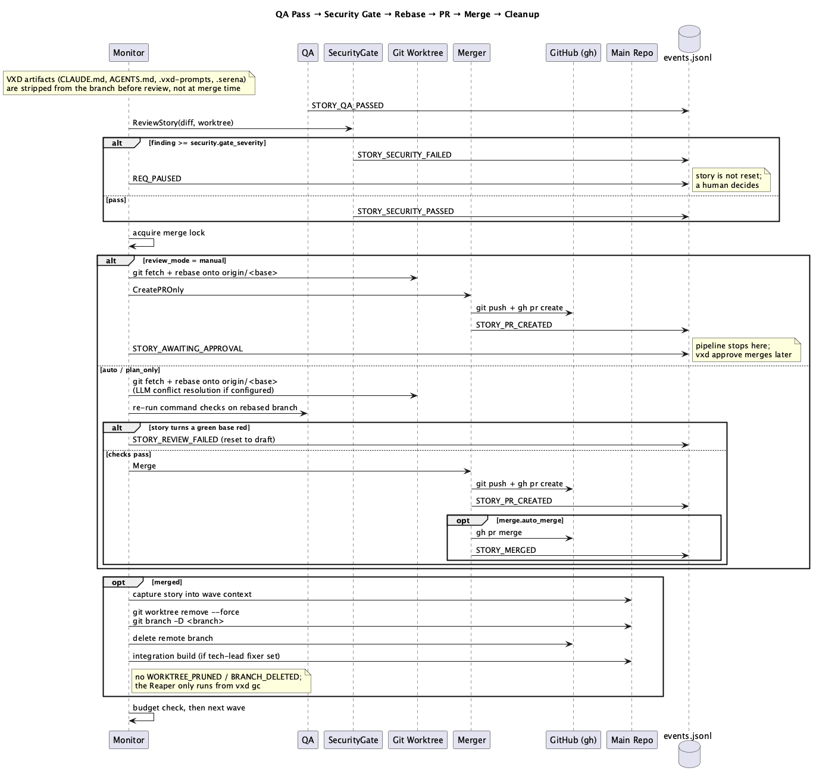
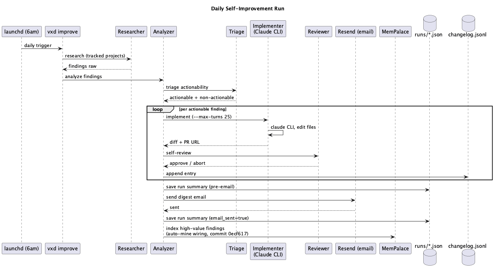
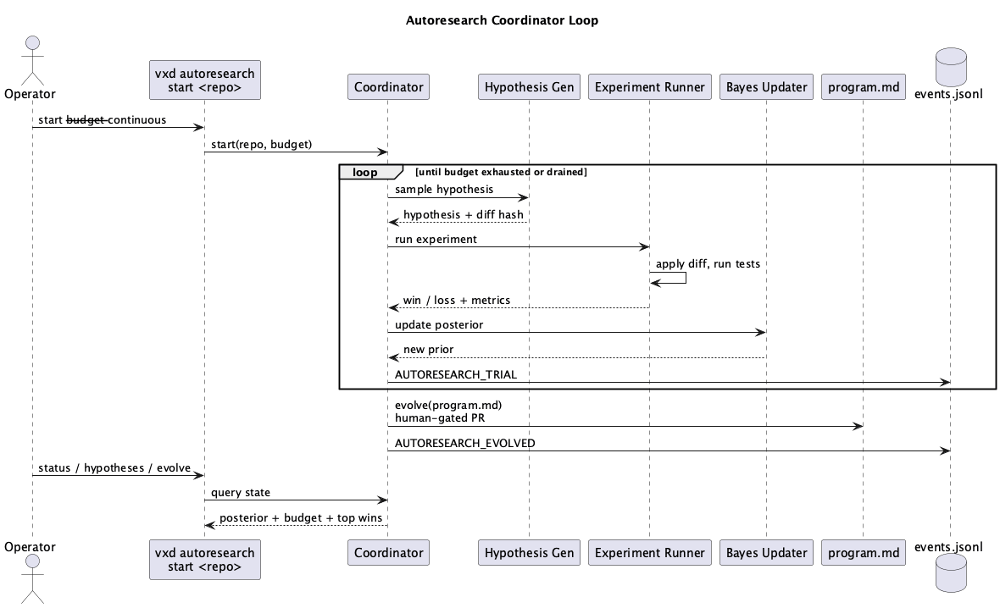

# Architecture

This guide covers VXD's internal architecture for contributors who want to understand, debug, or extend the system.

> **Full Architecture Overview:** For system diagrams, package dependency graphs, revenue pipeline design, Bayesian feedback mathematics, deployment strategy, competitive positioning, SLA framework, risk assessment, and revenue projections, see [`docs/architecture-overview.md`](architecture-overview.md).

## Design Principles

1. **Event sourcing** — all state changes are immutable events; current state is derived
2. **Pluggable runtimes** — AI CLI tools are abstracted behind a common interface
3. **Wave-based parallelism** — independent stories execute concurrently within dependency constraints
4. **Isolation** — each agent works in its own git worktree and tmux session

## Package Map

```
cmd/vxd/              Entry point — wires Cobra commands
internal/
  agent/              Role definitions, complexity scoring, prompt templates
  artifact/           Artifact store for launch configs, diffs, traces
  autoresearch/       Karpathy-style experiment harness: hypothesis loop, Bayesian posterior, program.md evolution
  cli/                Cobra command implementations (one file per command)
  codegraph/          Blast-radius analysis via code-review-graph; degrades gracefully if binary absent
  config/             YAML config loading, validation, defaults
  dashboard/          Bubbletea TUI (single-pane layout, all sections visible)
  engine/             Core orchestration pipeline
    planner.go        Tech Lead decomposition (LLM)
    dispatcher.go     Wave-based parallel dispatch (DAG)
    executor.go       Agent lifecycle: worktree creation, prompt injection, spawn
    watchdog.go       Session monitoring (fingerprinting)
    monitor.go        Polling loop with auto-resume, checkpoint writes, review gates
    supervisor.go     Drift detection (LLM)
    reviewer.go       Code review (LLM)
    review_gate.go    Human review gate: mode resolution + approval checks
    qa.go             Lint/build/test execution with declarative criteria
    merger.go         PR creation and auto-merge (gh CLI)
    reaper.go         Worktree/branch cleanup
    escalation.go     5-tier escalation machine (retry → senior → manager → tech_lead → pause)
    smart_retry.go    Error analysis with 8 categories and fix suggestions
    manager.go        Manager diagnosis: LLM failure analysis, story rewriting
    checkpoint.go     Crash recovery checkpoints (atomic write/read)
    recovery.go       Consistency check with 5 recovery scenarios
    lockfile.go       Advisory lock file with PID-based stale detection
    criteria.go       Declarative success criteria (6 kinds)
    attempts.go       Per-attempt tracking from event log
    cost.go           Cost estimation with Fibonacci-to-hours mapping
    estimator.go      Estimation orchestrator (quick heuristic + LLM-based)
    report.go         Client delivery report builder
    report_render.go  Markdown + HTML report renderers
    trace.go          Agent output trace normalization (8 event kinds)
    metrics.go        Pipeline metrics with trace-based agent activity stats
    wave_context.go   Cross-story context sharing (WAVE_CONTEXT.md injection)
    reputation.go     Per-agent performance scoring
    summary.go        Requirement completion summaries
    detect.go         LLM provider/model detection
    project.go        Multi-project isolation and state management
  git/                Repository scanning, branch/worktree/GitHub operations
  graph/              Dependency DAG with topological sort
  improve/            Self-improvement engine (research, analysis, implementation, revenue)
  llm/                LLM clients (Anthropic, OpenAI, Google AI, Claude CLI, Replay, Fallback)
  memory/             Memory dashboard, findings explorer, opportunity tracker, MemPalace integration
  notify/             Outbound webhook notifications for SLA breaches, completions, and pipeline failures (Slack/Discord/generic)
  preflight/          Pre-flight validation (15 checks, 3 severity tiers)
  repolearn/          3-pass repo learning (static scan, git history, LLM deep analysis)
  runtime/            Adapter/Runner pattern with pluggable execution targets
    adapter.go        Adapter interface (pure function command building)
    cli_adapter.go    CLIAdapter: Claude Code, Codex, Gemini CLI command prep
    runner.go         Runner interface (execution environment abstraction)
    tmux_runner.go    TmuxRunner: local tmux session execution
    docker_runner.go  DockerRunner: container-based execution
    ssh_runner.go     SSHRunner: remote machine execution
    sanitize.go       Input validation for shell-facing values
    registry.go       Runtime registry (backward-compatible with old Runtime interface)
  scratchboard/       Shared memory across parallel agents
  secrets/            Secret-store abstraction (env vars → Vault → other providers without code changes)
  state/              Event store + SQLite projections
  tmux/               Terminal session management
  web/                Web dashboard (WebSocket, embedded static files, command dispatch)
  devdb/              [SHIPPED 2026-05-22] Per-story ephemeral Postgres provider abstraction
    provider.go       Provider interface (Create/Fork/Delete/List/Schema/Ping)
    lifecycle.go      Lifecycle helper used by executor and QA
    null/             null.Provider (default no-op, used in tests)
    ghost/            ghost.Provider (VXD only — api.ghost.build HTTP client)
    docker/           docker.Provider (VXD + NXD — local Postgres + template DBs)
    envfile.go        .vxd-db/connect.env + README.md + psql.sh renderer
    naming.go         vxd-<project>-<story-id-short> DB naming convention
    recovery.go       Orphan-recovery on vxd resume
migrations/           SQLite schema (7 tables)
test/                 E2E tests
```

## Event Sourcing Model

VXD uses event sourcing as its core state management pattern.

### Write Path

```
Engine Component ──► NewEvent() ──► FileStore.Append() ──► events.jsonl
                                         │
                                         ▼
                                  SQLiteStore.Project() ──► SQLite tables
```

Every action in the system creates an `Event`:

```go
type Event struct {
    ID        string    // ULID (time-sortable unique ID)
    Type      EventType // e.g., STORY_CREATED, AGENT_SPAWNED
    Timestamp time.Time
    AgentID   string
    StoryID   string
    Payload   []byte    // JSON — event-specific data
}
```

Events are appended to `events.jsonl` (append-only, never modified) and simultaneously projected into SQLite tables for fast queries.

### Read Path

```
CLI Command ──► SQLiteStore.ListStories() ──► SQLite ──► Response
```

All queries read from SQLite projections, never from the event log directly. The event log is the source of truth; projections are derived and could be rebuilt.

### Event Types (45+)

Events are grouped by lifecycle:

| Group | Events |
|-------|--------|
| Request | `REQ_SUBMITTED`, `REQ_ANALYZED`, `REQ_PLANNED`, `REQ_PAUSED`, `REQ_RESUMED`, `REQ_COMPLETED`, `REQ_ESTIMATED` |
| Story | `STORY_CREATED`, `STORY_ESTIMATED`, `STORY_ASSIGNED`, `STORY_STARTED`, `STORY_PROGRESS`, `STORY_COMPLETED`, `STORY_REVIEW_REQUESTED`, `STORY_REVIEW_PASSED`, `STORY_REVIEW_FAILED`, `STORY_QA_STARTED`, `STORY_QA_PASSED`, `STORY_QA_FAILED`, `STORY_PR_CREATED`, `STORY_MERGED`, `STORY_ESCALATED`, `STORY_REWRITTEN`, `STORY_SPLIT`, `STORY_RESET` |
| Agent | `AGENT_SPAWNED`, `AGENT_CHECKPOINT`, `AGENT_RESUMED`, `AGENT_STUCK`, `AGENT_TERMINATED` |
| Supervisor | `SUPERVISOR_CHECK`, `SUPERVISOR_REPRIORITIZE`, `SUPERVISOR_DRIFT_DETECTED` |
| Review Gates | `REVIEW_MODE_SET`, `PLAN_APPROVED`, `PLAN_REJECTED`, `STORY_AWAITING_APPROVAL`, `STORY_APPROVED`, `STORY_REJECTED` |
| Recovery | `RECOVERY_COMPLETED` |
| Cleanup | `WORKTREE_PRUNED`, `BRANCH_DELETED`, `GC_COMPLETED` |

### Projection Store (SQLite)

7 tables materialized from events:

| Table | Primary Key | Updated By |
|-------|-------------|------------|
| `requirements` | `id` | `REQ_*` events |
| `stories` | `id` | `STORY_*` events |
| `agents` | `id` | `AGENT_*` events |
| `story_deps` | `story_id, depends_on` | `STORY_CREATED` |
| `escalations` | `id` | `ESCALATION_*` events |
| `agent_scores` | `agent_id, story_id` | Score computation |
| `projections` | `event_id` | All events (tracking) |

The `Project(event)` method on `SQLiteStore` contains a switch statement that maps each event type to the appropriate SQL mutations.

## Dependency Graph

The `graph` package implements a directed acyclic graph:

```go
type Graph struct {
    nodes map[string]bool
    edges map[string][]string  // node -> dependencies
}
```

Key operations:
- `AddNode(id)` / `AddEdge(from, to)` — build the graph
- `TopologicalSort()` — returns nodes in dependency order
- `ReadyNodes(completed)` — returns nodes whose dependencies are all in the completed set
- `HasCycle()` — validates the graph is acyclic

The Dispatcher uses `ReadyNodes()` to determine each wave of parallel execution.

## LLM Client Abstraction

```go
type Client interface {
    Complete(ctx context.Context, req CompletionRequest) (CompletionResponse, error)
}
```

Seven implementations:
- **AnthropicClient** — calls the Anthropic Messages API
- **OpenAIClient** — calls the OpenAI Chat Completions API
- **GoogleAIClient** — calls Google AI Studio (Gemma 4, free tier for execution roles)
- **ClaudeCLIClient** — invokes the Claude Code CLI as a subprocess
- **FallbackClient** — wraps a primary + secondary client with automatic failover on rate limits or quota exhaustion
- **RetryClient** — wraps any client with configurable retry logic
- **ReplayClient** — returns pre-configured responses (for testing)

The `ReplayClient` is essential for testing — it eliminates live API calls from unit and integration tests.

## Runtime Abstraction: Adapter/Runner Pattern

The runtime layer separates command preparation (pure) from execution (side effects) using two interfaces:

```go
// Adapter translates a SessionConfig into a PreparedExecution.
// Pure function — no side effects.
type Adapter interface {
    Prepare(cfg SessionConfig) (PreparedExecution, error)
    Name() string
    SupportedModels() []string
}

// Runner executes a PreparedExecution in some environment.
// Side effects happen here.
type Runner interface {
    Run(exec PreparedExecution) error
    Terminate(sessionID string) error
    SendInput(sessionID string, input string) error
    ReadOutput(sessionID string, lines int) (string, error)
    IsAlive(sessionID string) bool
}
```

The flow is:

```
SessionConfig ──► Adapter.Prepare() ──► PreparedExecution ──► Runner.Run()
                  (pure function)                            (side effects)
```

### Adapters

- **CLIAdapter** — builds commands for Claude Code, Codex, or Gemini CLI

### Runners

- **TmuxRunner** — executes agents in local tmux sessions
- **DockerRunner** — executes agents in Docker containers
- **SSHRunner** — executes agents on remote machines via SSH

The legacy `CLIRuntime` interface is preserved for backward compatibility in `registry.go`, wrapping the Adapter/Runner pair.

### Status Detection

Status detection uses compiled regex patterns per runtime:

```
ReadOutput() ──► match idle_pattern?      ──► StatusDone
              ──► match permission_pattern? ──► StatusPermissionPrompt
              ──► match plan_mode_pattern?  ──► StatusPlanMode
              ──► fingerprint changed?      ──► StatusWorking
              ──► fingerprint stale?        ──► StatusStuck
```

## Engine Component Interfaces

Each engine component depends on interfaces, not concrete implementations. This enables testing with mocks:

| Component | Interface Dependency | Test Double |
|-----------|---------------------|-------------|
| Planner | `llm.Client` | `ReplayClient` |
| Reviewer | `llm.Client` | `ReplayClient` |
| Supervisor | `llm.Client` | `ReplayClient` |
| Manager | `llm.Client` | `ReplayClient` |
| QA | `CommandRunner` | `mockRunner` |
| Merger | `GitHubOps` | `mockGitHubOps` |
| Reaper | `GitCleanupOps` | `mockCleanupOps` |
| Executor | `Adapter`, `Runner` | mock adapters/runners |
| ReviewGate | `state.EventStore` | in-memory store |
| EscalationMachine | `state.EventStore` | in-memory store |

## Data Flow: Full Pipeline

```
1. vxd req "..."
   │
   ├─ CLI parses args
   ├─ loadStores() opens FileStore + SQLiteStore
   ├─ buildLLMClient() creates Anthropic/OpenAI client
   │
   ▼
2. Planner.Plan(requirement, repoDir)
   │
   ├─ Calls Tech Lead LLM with system prompt
   ├─ Parses JSON response into PlannedStory[]
   ├─ Builds dependency Graph
   ├─ Emits: REQ_SUBMITTED, STORY_CREATED (×N), REQ_PLANNED
   │
   ▼
3. Dispatcher.Dispatch(graph, completedStories)
   │
   ├─ graph.ReadyNodes(completed) → wave
   ├─ RouteByComplexity(story.Complexity) → role
   ├─ git.CreateWorktree() + git.CreateBranch()
   ├─ runtime.Spawn(sessionConfig)
   ├─ Emits: AGENT_SPAWNED, STORY_ASSIGNED (per story in wave)
   │
   ▼
4. Watchdog.Monitor(sessions)
   │
   ├─ Loop: ReadOutput → Fingerprint → Compare
   ├─ Auto-actions: approve permissions, escape plan mode
   ├─ Detect completion → Emits: STORY_COMPLETED
   ├─ Detect stuck → Emits: AGENT_STUCK
   │
   ▼
5. Reviewer.Review(storyID, diff)
   │
   ├─ Calls Senior LLM with diff + criteria
   ├─ Parses verdict: approve/request_changes
   ├─ Emits: STORY_REVIEW_PASSED or STORY_REVIEW_FAILED
   │
   ▼
6. QA.Run(storyID, worktreePath)
   │
   ├─ Sequential: lint → build → test
   ├─ Records pass/fail + output + elapsed per check
   ├─ Emits: STORY_QA_STARTED, STORY_QA_PASSED or STORY_QA_FAILED
   │
   ▼
7. Merger.Merge(storyID, repoDir, branch)
   │
   ├─ git.PushBranch()
   ├─ github.CreatePR() → PR URL
   ├─ github.MergePR() (if auto_merge)
   ├─ Emits: STORY_PR_CREATED, STORY_MERGED
   │
   ▼
8. Reaper.Reap(storyID, repoDir, worktreePath, branch)
   │
   ├─ git.DeleteWorktree() (if immediate)
   ├─ git.DeleteBranch() (if past retention)
   ├─ Emits: WORKTREE_PRUNED, BRANCH_DELETED
   │
   ▼
9. Back to step 3 for next wave (if stories remain)
```

## Main Pipeline Sequence

```
User                VXD CLI          TechLead LLM     Dispatcher       Executor        Monitor
 |                    |                  |                |               |               |
 |-- vxd req ------->|                  |                |               |               |
 |                    |-- Plan -------->|                |               |               |
 |                    |<-- Stories ------|                |               |               |
 |                    |                  |                |               |               |
 |-- vxd resume ---->|                  |                |               |               |
 |                    |-- Lock + Preflight               |               |               |
 |                    |-- Recovery check |                |               |               |
 |                    |-- Dispatch wave --------------->|               |               |
 |                    |                  |                |-- Assign roles |               |
 |                    |                  |                |-- Create worktrees----------->|
 |                    |                  |                |               |-- Spawn tmux  |
 |                    |                  |                |               |               |
 |                    |                  |                |               |  +-------------+
 |                    |                  |                |               |  | Poll loop   |
 |                    |                  |                |               |  | every 10s   |
 |                    |                  |                |               |  +------+------+
 |                    |                  |                |               |         |      |
 |                    |                  |                |               |  Agent done -->|
 |                    |                  |                |               |         |      |
 |                    |                  |                |               |  <-- Review ---|
 |                    |                  |                |               |  <-- QA -------|
 |                    |                  |                |               |  <-- Merge ----|
 |                    |                  |                |               |         |      |
 |                    |                  |                |  <-- Next wave -----------------|
 |                    |                  |                |               |               |
```

## Escalation Chain

VXD uses a 5-tier escalation machine when agents fail. Each tier is attempted up to `max_retries_before_escalation` times before escalating to the next.

```
Tier 0: Same-role retry with smart error analysis
        - 8 error categories: missing_symbol, syntax, type_error, import,
          test_failure, build_config, environment, timeout
        - Each category carries a targeted fix suggestion
        - Actual build/test/lint errors are passed to the retry agent

Tier 1: Senior developer (more capable model)
        - Same error context, higher-tier agent

Tier 2: Manager diagnosis (Sonnet-class LLM)
        - Analyzes full failure pattern across all attempts
        - May rewrite the story description (STORY_REWRITTEN)

Tier 3: Tech Lead re-planning
        - Decomposes the failing story into smaller sub-stories (STORY_SPLIT)
        - Updates the dependency DAG with new nodes

Tier 4: Pause (human intervention required)
        - Story marked as paused, requires manual action
```

Events: `STORY_ESCALATED` (with `from_tier` and `to_tier`), `STORY_REWRITTEN`, `STORY_SPLIT`

## Crash Recovery

When a VXD process dies mid-run, the next `vxd resume` performs recovery:

```
1. Lock file acquisition
   - Advisory lock at ~/.vxd/projects/<name>/state/run.lock
   - PID-based stale detection (kills dead PIDs)
   - --force flag to override stuck locks

2. Consistency check (5 recovery scenarios)
   - Lost story: in_progress but no tmux session and no worktree → reset_to_draft
   - Orphan agent: dead tmux session but worktree exists → reset_to_draft
   - Mid-merge crash: PR created but not merged → resume_merge
   - Pre-PR crash: review passed but no PR → create_pr_and_merge
   - Stuck in review: review passed but QA never ran → reset_to_review_passed

3. Checkpoint-based merge recovery
   - Checkpoints written at phase transitions (dispatching, monitoring, merging)
   - Records active agents, wave number, PID
   - Atomic write with temp file + rename

4. Recovery actions executed automatically
   - RECOVERY_COMPLETED event emitted with details
   - Pipeline resumes from corrected state
```

## Human Review Gates

Three review modes control how much human oversight the pipeline requires:

```
Mode         Plan Gate      PR Gate
----------   -----------    -----------
auto         skip           auto-merge
plan_only    require        auto-merge
manual       require        require

Priority chain:
  1. --review / --auto CLI flags (highest, persisted as REVIEW_MODE_SET event)
  2. vxd.yaml merge.review_mode config value
  3. auto if merge.auto_merge is true, otherwise manual (fallback)
```

Commands: `vxd approve-plan`, `vxd reject-plan`, `vxd review`, `vxd approve`, `vxd reject`, `vxd approve --all <req-id>`

## Declarative Success Criteria

QA checks can be extended with declarative criteria in the story or config:

```yaml
qa:
  success_criteria:
    - kind: output_contains
      value: "PASS"
    - kind: file_exists
      path: coverage.html
    - kind: file_not_empty
      path: dist/bundle.js
```

Six criterion kinds:
- `output_contains` / `output_not_contains` — match against combined agent output
- `file_exists` — verify a file was created in the worktree
- `file_contains` — check file content for a substring
- `file_not_empty` — ensure a file has content
- `exit_code_zero` — verify clean exit

## Agent Context Sharing

Stories within a requirement can see what prior stories built via `WAVE_CONTEXT.md`:

```
Wave 1 stories complete → wave_context.go extracts summary of changes
  (files modified, packages added, interfaces defined)
    → WAVE_CONTEXT.md written into Wave 2 worktrees
      → Wave 2 agents see prior work, avoid conflicts
```

## Self-Improvement Pipeline

VXD includes an autonomous self-improvement engine:

```
Daily (6am cron via launchd):
  Research (Firecrawl scrape) --> Triage (Gemma 4) --> Analysis (Claude) -->
  Implementation (Claude CLI) --> PR --> Email report

Weekly digest: Sunday consolidation with action items

Repo Learning (3-pass, triggered by vxd learn):
  Pass 1: Static scan (marker files, configs, directory tree — no git, no LLM)
  Pass 2: Git history (commit patterns, contributors, churn hotspots)
  Pass 3: Deep analysis (LLM-assisted summary and architectural notes)

Output: RepoProfile JSON consumed by executor to enrich agent prompts
```

## Cost Estimation

```
vxd estimate "requirement text"
  |
  +-- Quick heuristic (keyword matching, no LLM call)
  |     Returns: story count estimate, complexity tier, hours, cost
  |
  +-- Full estimate (LLM-based decomposition)
        Returns: per-story breakdown with Fibonacci-to-hours mapping

Fibonacci-to-hours mapping (configurable):
  1 → 0.5h, 2 → 1h, 3 → 2h, 5 → 4h, 8 → 8h, 13 → 16h

Events: REQ_ESTIMATED with cost breakdown
```

## Testing Strategy

| Level | Location | What's Tested |
|-------|----------|---------------|
| Unit | `*_test.go` in each package | Individual functions with mocks |
| Integration | `state/integration_test.go`, `engine/integration_test.go` | Multi-component flows with real stores |
| E2E | `test/e2e_test.go` | Full pipeline with ReplayClient + mock git ops |

Key testing patterns:
- **ReplayClient** for deterministic LLM responses
- **Interface-based mocks** for git and command execution
- **Temp directories** for isolated file/SQLite stores
- **Build tag `e2e`** separates E2E tests from unit tests

## Diagrams

Rendered diagrams live under `docs/diagrams/`:

### High-Level Architecture

-  — `docs/diagrams/arch-overview.svg`
-  — req → stories → merge
-  — 5-tier escalation chain
-  — Go package DAG

### Sequence Diagrams

-  — requirement intake → story dispatch
-  — tier 0 → tier 4
-  — QA → PR → merge → cleanup
-  — daily self-improvement cycle
-  — coordinator loop

Regenerate D2/PlantUML diagrams via `./docs/diagrams/render.sh`. Regenerate the package-deps graph via `./docs/diagrams/gen-deps.sh`.
